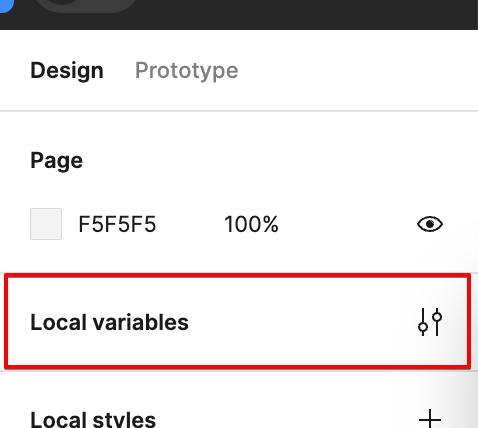
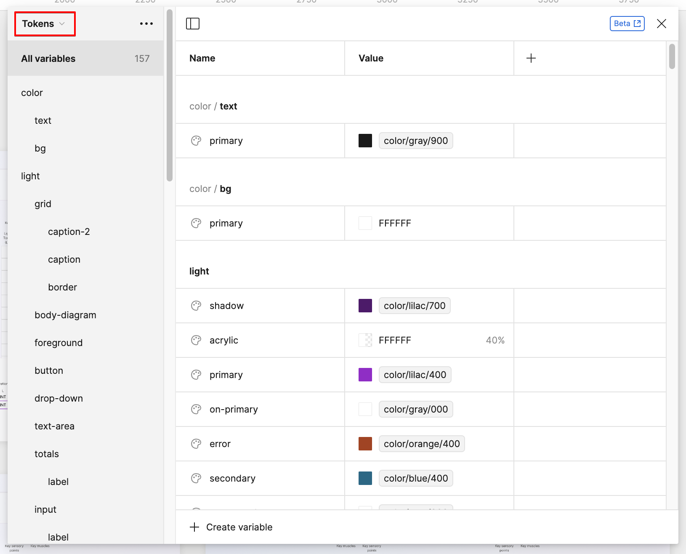
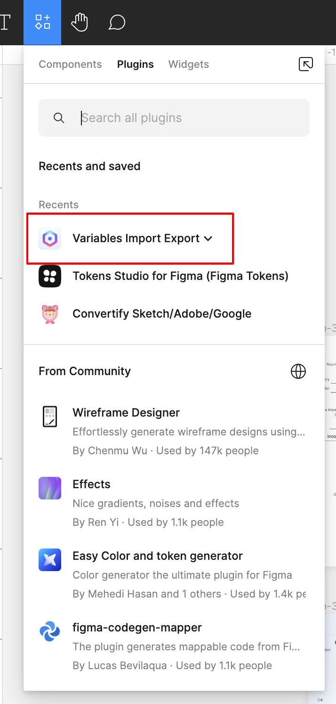
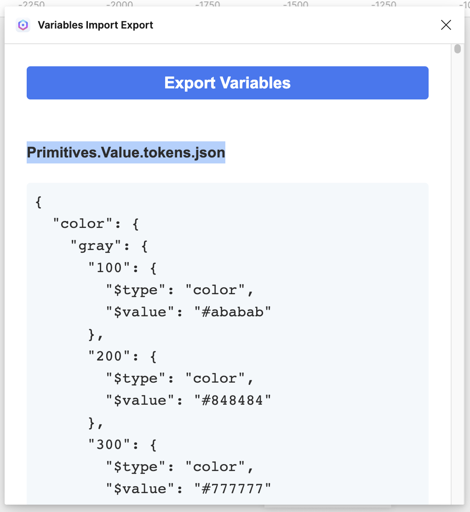
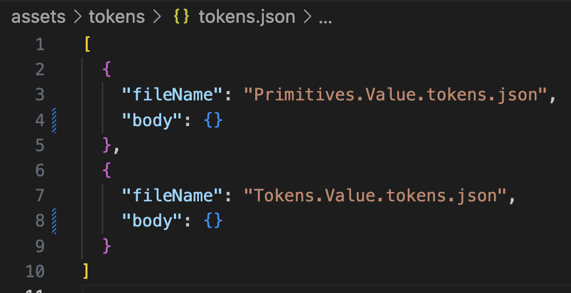

# Adding a design token

The source of truth for design tokens is the [Figma variables](https://www.figma.com/file/82mMuohRV0zPWnZbZ5upup/isncsci-app?type=design&node-id=207-9677&mode=design&t=bsPp0V9VaKYOoAti-0).
There are two groups, `Primitives` and `Tokens`. `Primitives` are the building blocks of tokens. `Tokens` are the final values that are used in the app.

## Adding a token in Figma

1. Open the [Figma file](https://www.figma.com/file/82mMuohRV0zPWnZbZ5upup/isncsci-app?type=design&node-id=207-9677&mode=design&t=bsPp0V9VaKYOoAti-0).
2. Make sure nothing is selected.
3. On the right panel, look for the `Local variables` button and press it.

   

4. The `Variables` panel will open. The top-left corner of the panel has a dropdown to switch between `Primitives` and `Tokens`. On the `Primitives` section you will find things like font sizes, spacing, colors, etc. On the `Tokens` section you will find the final values that are used in the app. The `Tokens` use the `Primitives` as building blocks. As a best practice, `Tokens` should not use custom values but should reference `Primitives` instead.

   

5. To add a new token, click on the `+ Create variable` button at the bottom of the panel.

## Importing tokens from Figma into the `praxis-isncsci/ui` project

1. Open the [Figma file](https://www.figma.com/file/82mMuohRV0zPWnZbZ5upup/isncsci-app?type=design&node-id=207-9677&mode=design&t=bsPp0V9VaKYOoAti-0).
2. Look for the `resources` button at the top-left portion of the interface and press it.
3. Select `Variables Import Export / Export variables`.

   

4. A modal will open showing an `Export variables` button. Press it.

5. The plugin will generate two `JSON` objects. One for `Primitives` and one for `Tokens`. We will copy these objects into the `praxis-isncsci/ui` project.

   

6. Open the `praxis-isncsci/ui` project.
7. Open the file `assets/tokens/tokens.json`.
8. Replace the object body for `Primitives.Value.tokens.json` with the JSON object generated by the plugin in Figma.
9. Replace the object body for `Tokens.Value.tokens.json` with the JSON object generated by the plugin in Figma.

   

10. Run the following command to update the tokens and CSS files: `npm run update-design-tokens`.
    The command runs the script `./scripts/generate-token-files.ts` which updates the files `primitives.values.tokens.json` and `tokens.value.tokens.json` and generates the files `primitives.values.css`.
    It then runs `build-styles` which uses the package `style-dictionary` to generate the file `assets/css/_tokens.css`.

## Adding tokens for values not supported by Figma variables

At the moment, not everything can be expressed as a Figma variable. Things like `box-shadow` values and gradients are not supported in Figma. For those cases, add the values to the file `assets/tokens/custom.value.tokens.json` which is also used to generate the file `assets/css/_tokens.css`.

## Colors

Tokens added in Figma under `Primitives/colors` are picked by the [Colors Storybook story](https://64f8d7c6e093108e99084a70-lqlepbrspv.chromatic.com/?path=/docs/designsystem-color--docs).
